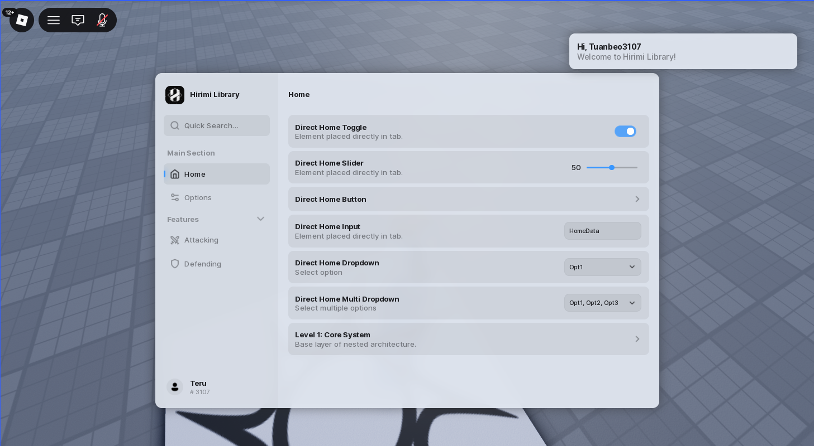
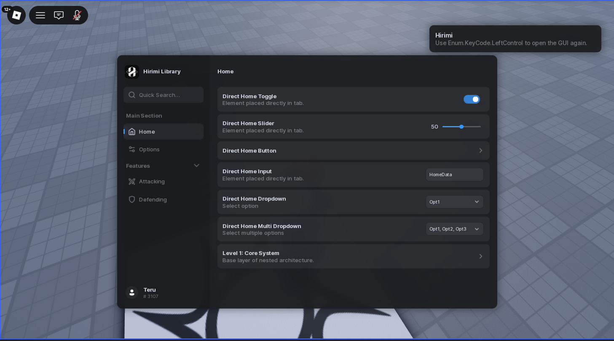

# Hirimi
A Roblox UI library built with Luau and designed for modern scripting utilities.



## ⚡ Features

* Fluent-compatible API
* 15+ Theme support
* Modular architecture
* Lightweight and customizable
* Support quick searching

## 📦 Installation

```lua
local library = loadstring(game:HttpGet(
    "https://github.com/teribu/Hirimi-Library/releases/latest/download/main.luau"
))()
```

## 📜 Usage

See the example implementation in: [example.luau](example.luau)

## ❤️ Credits

* [rojo](https://github.com/rojo-rbx/rojo) — Development workflow
* [bundler](https://github.com/teribu/Hirimi-Library/tree/main/addons/bundler.py) — Luau bundler using

## 📄 License

Licensed under the MIT License. See [LICENSE](LICENSE) for details.
